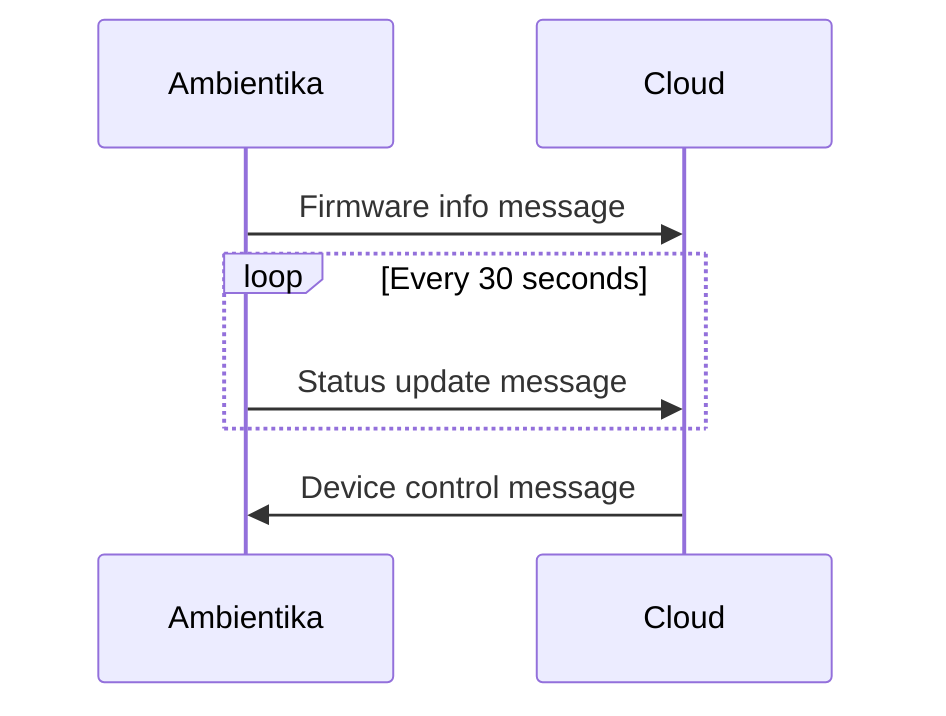

# Ambientika

Device initial setup is done via BLE. Wifi setup and cloud endpoint is configured in this setup.

The devices will connect to cloud on port 11000 via raw TCP socket connection.
All communication is done via this socket connection.

The master devices are sending commands for slave control via UPD broadcast in setup subnet.

Get device

bluetoothctl
menu scan
transport le
back
scan on

look for 
[NEW] Device AB:CD:EF:AB:CD:EF VMC_ABCDEFABCDEF

The device mac address is used as serial number

## Setup

### BLE (Wifi)

Setup device wifi via BLE GATT

Wifi service GATT identifier '0000a002' 
Wifi characteristic GATT identifier '0000c302'

Write to wifi characteristic:

With prefix "H_" the cloud host to connect to
<pre>H_app.ambientika.eu:11000</pre>

With prefix "S_" the SSID to connect to
<pre>S_Awesome Wifi Network</pre>

With prefix "P_" the wifi password
<pre>P_$ecur3</pre>

Ignore "invalid length errors (code 13)"

### Device Setup

When device wifi setup is done via BLE, device will connect to cloud to advertise himself.

Cloud is sending device setup

<Buffer 02 00 ab cd ef ab cd ef 00 00 02 ab 12 00 00>

The message will result in the following info:

**Device MAC address:** ab-cd-ef-ab-cd-ef 
**Device role:** MASTER 
**Device zone:** 0 
**Device house id :** 4779 

| Bytes | Description          | data type  |
|-------|----------------------|------------|
| 02    | fixed 02             | uint8      |
| 00    | fixed 00             | uint8      |
| ab    | mac octet            | hex string |
| cd    | mac octet            | hex string |
| ef    | mac octet            | hex string |
| ab    | mac octet            | hex string |
| cd    | mac octet            | hex string |
| ef    | mac octet            | hex string |
| 00    | ?                    | ?          |
| 00    | ?                    | ?          |
| 02    | device role          | uint8      |
| 00    | zone                 | uint8      |
| ab    | house id fourth part | uint32LE   |
| 12    | house id third part  | -          |
| 00    | house id second part | -          |
| 00    | house id first part  | -          |

Devices will connect to cloud on TCP/1100

## Device cloud communication

On startup device will connect to cloud via 11000/TCP. The communication contains three message types:

1. [Firmware info message](#firmware-info-message)
2. [Device status message](#device-status-message)
3. [Device command message](#device-status-message)

### Firmware info message

Uint8 Buffer 
<Buffer 03 00 ab cd ef ab cd ef 00 00 1c 00 01 16 02 01 00 00>

The message will result in the following info:

**Device MAC address:** ab-cd-ef-ab-cd-ef 
**Radio firmware version:** 0.0.28 
**Micro firmware version:** 0.1.22 
**Radio AT command firmware version:** 2.1.0.0

| Bytes | Description                     | data type  |
|-------|---------------------------------|------------|
| 03    | fixed 03                        | uint8      |
| 00    | fixed 00                        | uint8      |
| ab    | mac octet                       | hex string |
| cd    | mac octet                       | hex string |
| ef    | mac octet                       | hex string |
| ab    | mac octet                       | hex string |
| cd    | mac octet                       | hex string |
| ef    | mac octet                       | hex string |
| 00    | radio FW version part 1         | uint8      |
| 00    | radio FW version part 2         | uint8      |
| 1c    | radio FW version part 3         | uint8      |
| 00    | micro FW version part 1         | uint8      |
| 01    | micro FW version part 2         | uint8      |
| 16    | micro FW version part 3         | uint8      |
| 02    | radio AT command version part 1 | uint8      |
| 01    | radio AT command version part 2 | uint8      |
| 00    | radio AT command version part 3 | uint8      |
| 00    | radio AT command version part 4 | uint8      |

### Device status message

Uint8 Buffer 
<Buffer 01 00 ab cd ef ab cd ef 01 02 01 14 37 02 01 00 00 00 01 03 c3>

The message will result in the following info:

**Device MAC address:** ab-cd-ef-ab-cd-ef 
**Operating mode:** AUTO 
**Fan speed:** HIGH 
**Humidity level:** NORMAL 
**Temperature:** 20 °C 
**Humidity:** 55 % 
**Air quality:** FAIR 
**Humidity alarm:** ON 
**Filter status:** GOOD 
**Night alarm:** OFF 
**Device role:** MASTER 
**Last operating mode:** AUTO 
**Light sensitivity :** MEDIUM 
**Wifi signal strength (mW) :** 195 

| Bytes | Description          | convert to data type |
|-------|----------------------|----------------------|
| 01    | fixed 01             | uint8                |
| 00    | fixed 00             | uint8                |
| ab    | mac octet            | hex string           |
| cd    | mac octet            | hex string           |
| ef    | mac octet            | hex string           |
| ab    | mac octet            | hex string           |
| cd    | mac octet            | hex string           |
| ef    | mac octet            | hex string           |
| 01    | operating mode       | uint8                |
| 02    | fan speed            | uint8                |
| 01    | humidity level       | uint8                |
| 14    | temperature          | uint8                |
| 37    | humidity             | uint8                |
| 02    | air quality          | uint8                |
| 01    | humidity alarm       | uint8                |
| 00    | filter status        | uint8                |
| 00    | night alarm          | uint8                |
| 00    | device role          | uint8                |
| 01    | last operating mode  | uint8                |
| 03    | light sensitivity    | uint8                |
| c3    | wifi signal strength | uint8                |

**Operating mode**

| int | mode                 |
|-----|----------------------|
| 0   | SMART                |
| 1   | AUTO                 |
| 2   | MANUAL_HEAT_RECOVERY |
| 3   | NIGHT                |
| 4   | AWAY_HOME            |
| 5   | SURVEILLANCE         |
| 6   | TIMED_EXPULSION      |
| 7   | EXPULSION            |
| 8   | INTAKE               |
| 9   | MASTER_SLAVE_FLOW    |
| 10  | SLAVE_MASTER_FLOW    |
| 11  | OFF                  |

**Fan speed**

| int | mode   |
|-----|--------|
| 0   | LOW    |
| 1   | MEDIUM |
| 2   | HIGH   |

**Humidity level**

| int | mode   |
|-----|--------|
| 0   | DRY    |
| 1   | NORMAL |
| 2   | MOIST  |

**Temperature**
Temperature in celsius

**Humidity**
Humidity in percent

**Air quality**

| int | mode      |
|-----|-----------|
| 1   | GOOD      |
| 2   | FAIR      |
| 3   | MODERATE  |
| 4   | POOR      |
| 5   | VERY_POOR |

**Humidity alarm**

| int | mode |
|-----|------|
| 0   | OFF  |
| 1   | ON   |

**Filter status**

| int | mode   |
|-----|--------|
| 0   | GOOD   |
| 1   | MEDIUM |
| 2   | BAD    |

**Night alarm**

| int | mode |
|-----|------|
| 0   | OFF  |
| 1   | ON   |

**Device role**

| int | mode                  |
|-----|-----------------------|
| 0   | MASTER                |
| 1   | SLAVE_EQUAL_MASTER    |
| 2   | SLAVE_OPPOSITE_MASTER |

**Last operating mode**

See operating mode

**Light sensitivity**

| int | mode   |
|-----|--------|
| 1   | OFF    |
| 2   | LOW    |
| 3   | MEDIUM |

## Commands send to device

Commands are send on socket connection to device

### Change device operating mode

Uint8 Buffer 
<Buffer 02 00 ab cd ef ab cd ef 01 01 01 01 02>

The message will result in the following info:

**Device MAC address:** ab-cd-ef-ab-cd-ef 
**Operating mode:** AUTO 
**Fan speed:** MEDIUM 
**Humidity level:** NORMAL 
**Light sensitivity :** LOW 

| Bytes | Description       | data type  |
|-------|-------------------|------------|
| 02    | fixed 02          | uint8      |
| 00    | fixed 00          | uint8      |
| ab    | mac octet         | hex string |
| cd    | mac octet         | hex string |
| ef    | mac octet         | hex string |
| ab    | mac octet         | hex string |
| cd    | mac octet         | hex string |
| ef    | mac octet         | hex string |
| 01    | ? fixed           | uint8      |
| 01    | operating mode    | uint8      |
| 01    | fan speed         | uint8      |
| 01    | humidity level    | uint8      |
| 02    | light sensitivity | uint8      |

### Device filter reset

Uint8 Buffer 
<Buffer 02 00 ab cd ef ab cd ef 03>

**Device MAC address:** ab-cd-ef-ab-cd-ef 

| Bytes | Description | data type  |
|-------|-------------|------------|
| 02    | fixed 02    | uint8      |
| 00    | fixed 00    | uint8      |
| ab    | mac octet   | hex string |
| cd    | mac octet   | hex string |
| ef    | mac octet   | hex string |
| ab    | mac octet   | hex string |
| cd    | mac octet   | hex string |
| ef    | mac octet   | hex string |
| 03    | fixed       | uint8      |

### Weather update

For SMART mode the devices will get weather updates from the cloud.
There seems to be no fixed interval, maybe based on significant value changes in temperature and/or humidity, air
quality

Uint8 Buffer 
<Buffer 02 00 ab cd ef ab cd ef 04 b0 06 59 01>

The message will result in the following info:

**Device MAC address:** ab-cd-ef-ab-cd-ef 
**Temperature:** 17.12 
**Humidity:** 89 
**Air quality:** VERY_GOOD

| Bytes | Description             | data type  |
|-------|-------------------------|------------|
| 02    | fixed 02                | uint8      |
| 00    | fixed 00                | uint8      |
| ab    | mac octet               | hex string |
| cd    | mac octet               | hex string |
| ef    | mac octet               | hex string |
| ab    | mac octet               | hex string |
| cd    | mac octet               | hex string |
| ef    | mac octet               | hex string |
| 04    | fixed                   | uint8      |
| b0    | temperature second part | -          |
| 06    | temperature third part  | -          |
| 59    | humidity                | uint8      |
| 01    | air quality             | uint8      |

### Master Slave communication

Master-Slave communication is done via UDP Broadcast from every master in a zone.
UDP broadcast is send from port 46000 + zone id to 45000 + zone id

<Buffer 65 30 28 00 00 12 ab>

| Bytes | Description          | data type |
|-------|----------------------|-----------|
| 65    | fixed 65             |           |
| 3     | fixed 3              | uint4     |
| 0     | zone id 0            | uint4     |
| 2     | fan mode             | uint4     |
| 8     | speed and direction  | uint4     |
| 00    | house id first part  | uint32BE  |
| 00    | house id second part |           |
| 12    | house id third part  |           |
| ab    | house id fourth part |           |

**fan mode**

| int | mode        |
|-----|-------------|
| 0   | OFF         |
| 2   | ALTERNATING |
| 3   | PERMANENT   |

**fan speed and direction**

| int | speed and direction     |
|-----|-------------------------|
| 0   | STOP (switch direction) |
| 1   | STARTUP SPEED?          |
| 2   | STARTUP SPEED?          |
| 3   | OFF                     |
| 4   | EXPULSION_NIGHT         |
| 5   | EXPULSION_LOW           |
| 6   | EXPULSION_MEDIUM        |
| 7   | EXPULSION_HIGH          |
| 8   | INTAKE_NIGHT            |
| 9   | INTAKE_LOW              |
| 10  | INTAKE_MEDIUM           |
| 11  | INTAKE_HIGH             |
