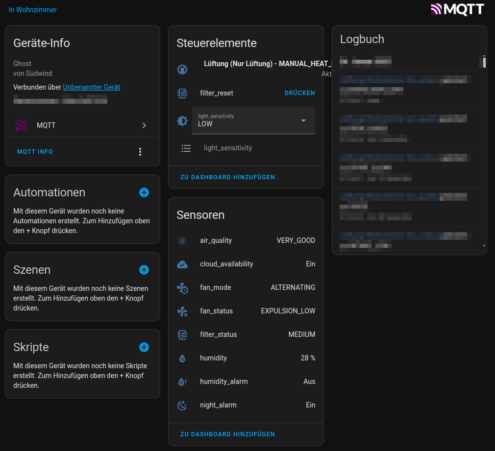
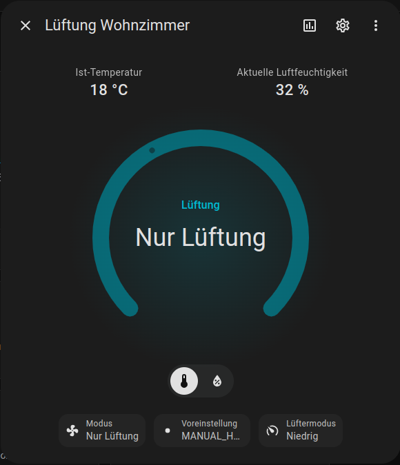
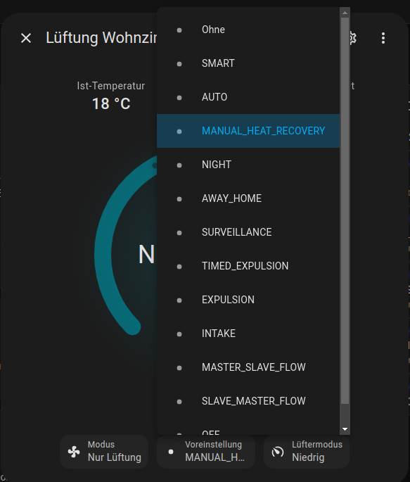

# Ambientika local cloud

This software is meant for personal use only and the repository will not be actively maintained.

The NodeJS application provides an api compatible interface to the ambientika cloud. The devices can be controlled and monitored locally and optionally connected to native ambientika cloud.

The integration into Home Assistant is done via MQTT.
Home Assistant MQTT and auto discovery.





Information about the protocol, provisioning and communication can be found here.

To use this software the traffic from the devices need to connect directly via port 11000/TCP to this application. This can be achieved via DNAT, static routes or changing the cloud endpoint on the devices in the provisioning process. Or may there are further possibilities to achieve this.

## Protocol
To build this application the ambientika protocol was analyzed, for further details visit: [Protocol documentation](ambientika-protocol.md)


## NodeJS build

```
npm install
npm start
```
OR
```
npm build
```
## Docker build
```
docker build -t $imagename .
```

## Start Docker
To use all features of this application the application or docker container must be run in the same subnet of the devices. This is needed due the nature of UDP broadcasts. 

Minimal docker compose example
```
services:
  ambientika:
    image: ghcr.io/sragas/ambientika-local-control:release
    restart: unless-stopped
    container_name: ambientika-local
    env_file: /docker/ambientika/env
    network_mode: host
    cap_add:
      - NET_ADMIN

```


## Home Assistant Add-on

This application is available as a Home Assistant add-on. See [Installation Guide](#home-assistant-installation) below.

### Home Assistant Installation

1. Add this repository to your Home Assistant add-on store
2. Install the "Ambientika Local Control" add-on
3. Configure MQTT settings in the add-on configuration
4. Provision your devices (see [Device Provisioning](#device-provisioning))
5. Start the add-on

### Device Provisioning

Before using this add-on, provision your devices to connect locally:

1. Use a BLE app (LightBlue Explorer/nRF Connect)
2. Connect to device `VMC_ABCDEFABCDEF`
3. Find service `0000a002-*`, characteristic `0000c302-*`
4. Write: `H_<HA_IP>:11000`, `S_<WIFI_SSID>`, `P_<WIFI_PASSWORD>`

## Configuration
Default configuration is found in [.env](.env)
Provide following configuration via env_file:

MQTT_CONNECTION_STRING

And change other values matching your setup. i.e 

ZONE_COUNT

Connection to ambientika cloud can be disabled with:

CLOUD_SYNC_ENABLED=false


